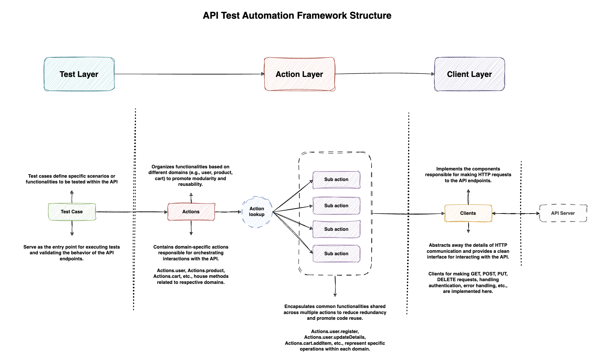

# Python API Automation Framework

Welcome to the Python API Automation Framework repository! This framework is designed to streamline the process of writing and executing automated tests for various E2E API endpoints.

Below is an overview of the framework architecture, folder structure, features, how to use this framework, and insights.

## Framework Architecture



## Folder Structure

```
.
├── Dockerfile
├── README.md
├── envs
│   └── qa
│       ├── endpoints.toml
│       └── manifest.toml
├── globals.py
├── manifest.toml
├── poetry.lock
├── poetry_cheatsheet.md
├── pyproject.toml
├── pytest.ini
├── scripts
│   ├── execution
│   │   ├── execute_in_local.sh
│   │   └── execute_in_pipeline.sh
│   └── util-scripts
│       ├── clear-reports.sh
│       ├── discord-notification.sh
│       ├── generate-allure-report.sh
│       └── slack-notification.sh
├── src
│   ├── actions
│   │   ├── actions_lookup.py
│   │   └── user_actions.py
│   ├── clients
│   │   └── user_client.py
│   ├── models
│   │   ├── envs_models
│   │   │   ├── config_models.py
│   │   │   └── endpoints_models.py
│   │   ├── request_models
│   │   │   └── create_user_request_model.py
│   │   ├── response_models
│   │   │   └── create_user_response_model.py
│   │   └── utils_models
│   │       └── response_model.py
│   └── utils
│       ├── base_client.py
│       ├── config_parser.py
│       ├── decorators
│       │   └── meta_data_decorator.py
│       ├── file_dir_operations.py
│       ├── json_parser.py
│       ├── logger.py
│       ├── random_data_generator.py
│       ├── remove_python_cache_files.py
│       ├── request_payload_generator.py
│       ├── test_summary_extractor.py
│       └── toml_operations.py
└── tests
    ├── conftest.py
    ├── data
    │   ├── assert_messages
    │   │   └── user_service.py
    │   └── test_data
    │       └── user_service.json
    ├── fixtures.py
    └── user_service_test.py
```

1. **Configuration**: Update the configuration files in the `envs` folder as per the requirements based on the test environment (QA, Stage, or Prod).

2. **Scripts**: Utilize the script files in the `scripts` folder for execution, reporting, and notification tasks.

3. **Actions**: Write action files in the `src/actions` folder to interact with the system under test.

4. **Clients**: Implement client files in the `src/clients` folder for making requests to the system under test.

5. **Models**: Define request, response, and utility models in the `src/models` folder based on the business domain.

6. **Utilities**: Utilize utility files in the `src/utils` folder for common functionalities needed in the tests.

7. **Tests**: Write test modules in the `tests` folder to automate test cases for the application.

## Feature Table

| Feature                            | Description                                                                          | Status | Customizable |
| ---------------------------------- | ------------------------------------------------------------------------------------ | ------ | ------------ |
| Allure Reporting                   | Generates detailed test execution reports                                            | ✓      | Yes          |
| Slack Notification                 | Sends test execution notifications to Slack                                          | ✓      | Yes          |
| Discord Notification               | Sends test execution notifications to Discord                                        | ✓      | Yes          |
| Parallel Execution                 | Executes test cases concurrently for faster execution                                | ✓      | Yes          |
| Multiple Environment Support       | Supports running tests in different environments (QA, Stage, Prod)                   | ✓      | Yes          |
| Logging                            | Captures logs for each test case execution and integrates them with Allure reports   | ✓      | Yes          |
| CI/CD Integration (GitHub Actions) | Utilizes GitHub Actions and Docker containers for test execution in a CI/CD pipeline | ✓      | Yes          |
| Flexibility                        | Allows adding new features without tightly coupling them to the framework            | ✓      | Yes          |

## How to Add a Test Case

Follow these steps to add a new test case to the Python API Automation Framework:

1. **Identify the API Endpoint and Payload**:

    - Obtain the cURL command or API documentation for the endpoint you want to test.
    - Example cURL command:
        ```
        curl --location 'https://friendly-boba-c46af4.netlify.app/todos/user/create' \
        --header 'Content-Type: application/json' \
        --data-raw '{
          "username": "example_user_8",
          "password": "password124",
          "email": "example@examples22.com"
        }'
        ```

2. **Create Request and Response Models**:

    - Based on the API payload and response, create the corresponding Pydantic data classes in the `src/models` directory.
    - Request Model Example (`src/models/request_models/create_user_request_model.py`):

        ```python
        from pydantic.dataclasses import dataclass

        @dataclass
        class CreateUserRequestModel:
            username: str = ""
            email: str = ""
            password: str = ""
        ```

    - Response Model Example (`src/models/response_models/create_user_response_model.py`):

        ```python
        from pydantic.dataclasses import dataclass
        from src.models.utils_models.response_model import ResponseModel

        @dataclass
        class _CreateUserBodyModel:
            user_id: str
            access_token: str

        @dataclass
        class CreateUserResponseModel(ResponseModel):
            data: _CreateUserBodyModel
        ```

    - Note: The response model inherits from the common `ResponseModel` class defined in `src/models/utils_models/response_model.py`.

3. **Implement the Client Method**:

    - Create a client class in the `src/clients` directory to handle the API request.
    - Client Example (`src/clients/user_client.py`):

        ```python
        from typing import TypeVar, Callable
        from src.utils.config_parser import ENDPOINTS
        from src.utils.base_client import RequestDirectory
        from pydantic import BaseModel

        T = TypeVar("T", bound=BaseModel)

        class UserClient:
            @staticmethod
            def create_user(data: BaseModel, response_model: Callable[..., T]) -> T:
                response = RequestDirectory.post.with_endpoint(
                    ENDPOINTS.user.create_new_user).with_data(data).send()
                return response_model(**response)
        ```

    - Note: All the endpoints, are captured / moved to envs, and respective environment folder's `endpoints.toml` file

4. **Create Actions**:

    - Create an action class in the `src/actions` directory to encapsulate the client method.
    - Action Example (`src/actions/user_actions.py`):

        ```python
        from src.clients.user_client import UserClient
        from src.models.response_models.create_user_response_model import *
        from src.models.request_models.create_user_request_model import *

        class UserActions:
            @staticmethod
            def create_new_user(data: CreateUserRequestModel) -> CreateUserResponseModel:
                return UserClient.create_user(data, CreateUserResponseModel)
        ```

    - Note: The action class acts as a layer of abstraction between the test case and the client, making the test more readable and maintainable and also providing flexibility to re-use the other clients when the API is chained to get final desired response.

5. **Add the Action to the Actions Lookup**:

    - Update the `src/actions/actions_lookup.py` file to include the new action.
    - Actions Lookup Example:

        ```python
        from src.actions.user_actions import UserActions

        class Actions:
            user = UserActions
        ```

6. **Write the Test Case**:

    - Create a new test file or add the test case to an existing test file in the `tests` directory.
    - Test Case Example (`tests/user_service_test.py`):

        ```python
        import pytest
        from http import HTTPStatus

        from src.actions.actions_lookup import Actions
        from src.models.request_models.create_user_request_model import *
        from fixtures import suite_scope, test_scope
        from src.utils.request_payload_generator import RequestPayloadGenerator
        from tests.data.assert_messages import user_service

        from src.utils.decorators.meta_data_decorator import meta_data, MetaData

        @pytest.mark.usefixtures("suite_scope", "test_scope")
        class UserServiceTests:

            @pytest.mark.local  # To execute in local we use the "local marker"
            @pytest.mark.regression
            @meta_data(data=MetaData(tags=["positive-tc", "smoke"],
                                     description="This test attempts to create a new user successfully",
                                     author="Jane",
                                     test_case_id="TC001", severity="critical"))
            def test_successful_user_creation(self):
                # Arrange
                username, email, password = RequestPayloadGenerator.create_new_user_payload().values()
                user_data = CreateUserRequestModel(
                    username=username, email=email, password=password)

                # Act
                response = Actions.user.create_new_user(user_data)

                # Assert
                assert response.status == HTTPStatus.CREATED
                assert response.data.access_token != None
        ```

    - Use markers, meta_data, and the AAA (Arrange-Act-Assert) pattern to structure the test case.

By following these steps, you can easily add new test cases to the Python API Automation Framework. The framework's modular structure and separation of concerns make it straightforward to integrate new tests without modifying existing code.

Remember to keep your test cases focused, readable, and maintainable. Utilize the provided utilities, fixtures, and decorators to enhance your tests and capture relevant metadata.

## Running Tests in Local

You're right, my apologies. Let me update the instructions to use Poetry instead of creating a virtual environment manually:

## Running Tests

To run the tests locally, follow these steps:

1. **Install Poetry**:

    - Poetry is a dependency management tool for Python. Install it by following the instructions provided on the official Poetry website: https://python-poetry.org/docs/#installation.

2. **Create and Activate the Virtual Environment**:

    - Open a terminal and navigate to the project root directory.
    - Run the following command to create and activate a new virtual environment:
        ```
        poetry shell
        ```

3. **Install Dependencies**:

    - With the virtual environment activated, run the following command to install the project dependencies:
        ```
        poetry install --no-root
        ```

4. **Run Tests**:
    - To execute tests locally, you need to add the `@pytest.mark.local` marker on top of the test cases you want to run.
    - After adding the marker, execute the following shell script:
        ```
        sh scripts/execution/execute_in_local.sh
        ```
    - This script will run the tests marked with `@pytest.mark.local`.

Make sure to follow these steps before running the tests locally. The script `execute_in_local.sh` is responsible for executing the tests in your local environment.

## Execution over Github Actions

The Python API Automation Framework is designed to be executed in a CI/CD pipeline using GitHub Actions and Docker containers. This approach ensures consistent and reproducible test execution environments across different platforms and systems.

To achieve this, the framework is containerized into a Docker image that includes all the necessary dependencies, test code, and configurations. The Dockerfile in the project root directory defines the instructions for building the Docker image.

During the GitHub Actions workflow, the following steps are performed:

1. **Checkout Code**: The repository code is checked out from the specified branch or commit.

2. **Build Docker Image**: The Docker image is built using the Dockerfile, which installs the required dependencies and copies the project files into the container.

3. **Run Docker Container**: A new Docker container is created from the built image, and the `scripts/execution/execute_in_pipeline.sh` script is executed within the container. This script is responsible for running the tests in the CI/CD environment.

4. **Generate Allure Reports**: After the tests are executed, the script generates Allure reports, which provide detailed information about the test execution, including test cases, steps, and results.

5. **Notification**: Depending on the configuration, the framework can send notifications to Slack or Discord channels, providing updates on the test execution status and any failures or errors that occurred.

6. **Artifact Uploads**: The Allure reports and any other relevant artifacts can be uploaded as build artifacts, making them accessible for further analysis or archiving.

By containerizing the test application, the framework ensures that the test execution environment is consistent and isolated, eliminating potential conflicts or issues caused by different system configurations or dependencies. Additionally, the use of Docker containers in the CI/CD pipeline enables parallel execution of tests in **SHARDS** (Can be extended), further optimizing the testing process.

## Environment Variables and Configuration Flow

The framework follows a specific order when loading configurations from different sources. This order ensures that environment-specific settings override global settings, allowing flexibility and customization during test execution.

1. **Environment Variables**:

    - Environment variables take the highest priority.
    - These variables can be set in the terminal before running tests or defined in the CI/CD pipeline configuration.

2. **Main Configuration File**:

    - The `manifest.toml` file in the project root directory holds global configurations.
    - If a configuration is not specified in the environment variables, the framework uses the global configuration from this file.

3. **Environment-Specific Configuration Files**:
    - The `envs` directory contains subdirectories for each environment (e.g., `qa`, `stage`, `prod`).
    - Each environment subdirectory has a `manifest.toml` file with environment-specific configurations.
    - The framework loads configurations from the `manifest.toml` file corresponding to the target environment, if they are not found in the main manifest file or passed from terminal.

**The order of priority when loading configurations is as follows**:

1. Environment Variables
2. Environment-specific `manifest.toml` file
3. Main `manifest.toml` file

## In-sights

WIP
